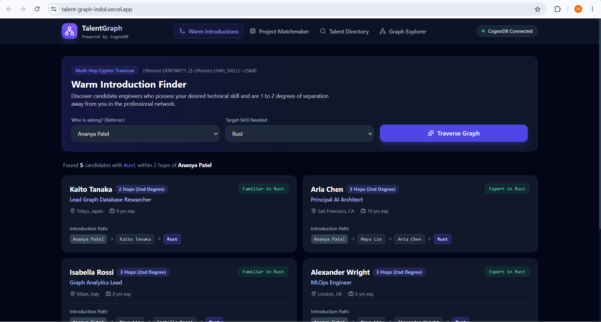
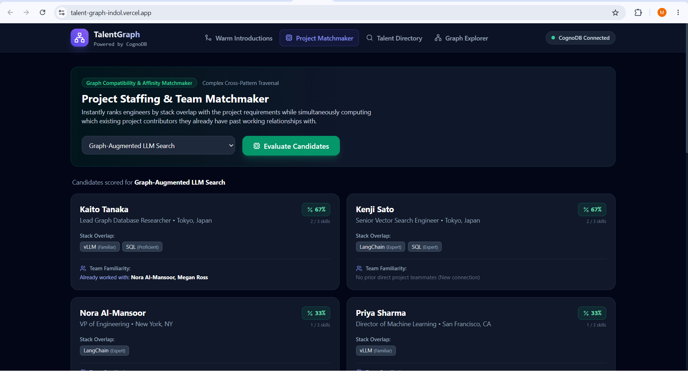
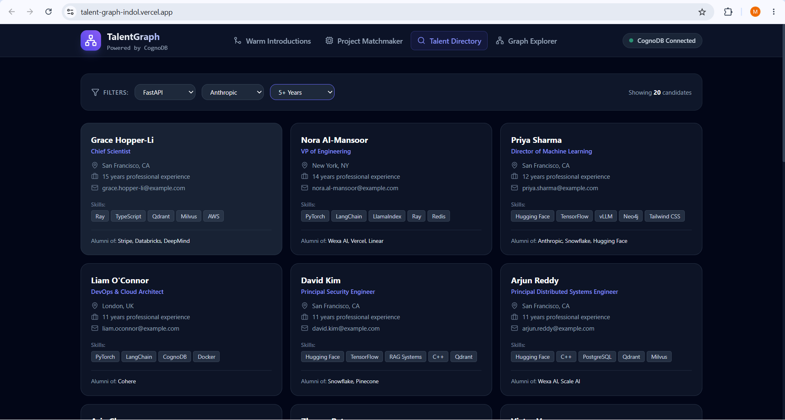
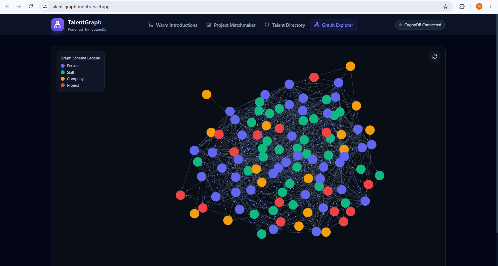
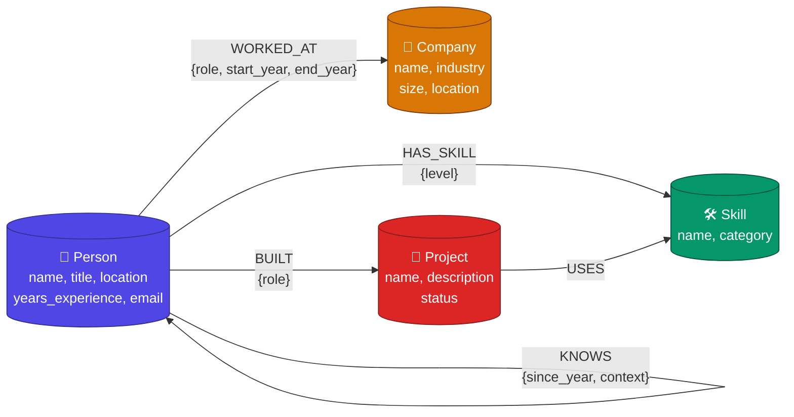

# 🌐 TalentGraph — Tech Talent & Skills Knowledge Graph

> An intelligent talent exploration and project team matchmaking platform powered by **[CognoDB](https://cognodb.com)** and **openCypher**.

[-6366f1?style=flat-square)](https://console.cognodb.com)
[-009688?style=flat-square)](https://fastapi.tiangolo.com)
[](https://react.dev)

---

## 🔗 Live Demo & Walkthrough

- 🚀 **Hosted Application:** [https://talent-graph-indol.vercel.app/]
                              [https://talent-graph-backend.onrender.com]
- 📹 **Screen Recording:** [INSERT YOUR VIDEO LINK HERE]

---

## 📸 UI Screenshots

| Warm Introductions (Multi-Hop) | Project Matchmaker |
|---|---|
|  |  |

| Talent Directory | Interactive Graph Explorer |
|---|---|
|  |  |

> *Replace the images above with your own screenshots after deployment.*

---

## 🎯 1. Use Case Overview

Modern engineering teams, talent partners, and CTOs struggle to answer relationship-driven questions about engineering networks:

- *"Who in our team's second-degree network has production experience with Rust and RAG systems?"*
- *"Who can give a warm referral for candidate X?"*
- *"Which engineers have the ideal skill overlap for Project Y and have already collaborated with current project members?"*

**TalentGraph** models engineers, skills, past employers, and software projects as an interconnected knowledge graph. It provides an intuitive web interface for non-technical recruiters and engineering managers to traverse multi-hop relationship paths in real time.

---

## 💡 2. Why a Graph Database?

Relational databases (RDBMS) excel at tabular, transactional data. However, talent networking and skill affinity are inherently **graph-shaped**.

### Relational Approach (JOIN Hell)

```sql
-- Finding 2nd-degree connections with a specific skill in SQL:
SELECT DISTINCT p3.name
FROM Person p1
JOIN Person_Knows pk1 ON p1.id = pk1.person_a_id
JOIN Person p2 ON pk1.person_b_id = p2.id
JOIN Person_Knows pk2 ON p2.id = pk2.person_a_id
JOIN Person p3 ON pk2.person_b_id = p3.id
JOIN Person_Skill ps ON p3.id = ps.person_id
JOIN Skill s ON ps.skill_id = s.id
WHERE p1.name = 'Aria Chen'
  AND s.name = 'Rust'
  AND p3.id <> p1.id;
-- Now imagine adding a 3rd hop, team affinity, and skill overlap scoring...
```

### Graph Approach (CognoDB / openCypher)

```cypher
MATCH path = (me:Person {name: 'Aria Chen'})-[:KNOWS*1..2]-(candidate)-[:HAS_SKILL]->(:Skill {name: 'Rust'})
RETURN candidate.name, length(path) AS hops, [n IN nodes(path) | n.name] AS intro_path;
```

### Comparison Table

| Feature / Query | Relational (PostgreSQL) | Graph (CognoDB) |
|---|---|---|
| **Multi-Hop Referrals (2+ hops)** | 4+ self-joins on junction tables. Performance degrades exponentially with depth. | Index-free adjacency. Single pattern: `(:Person)-[:KNOWS*1..2]-(:Person)`. Constant cost per hop. |
| **Team Affinity Matchmaking** | Multiple subqueries, CTEs, and aggregations to correlate skill overlap + co-employment. | Compact pattern match extracting overlap and colleague familiarity in one pass. |
| **Schema Evolution** | Adding entities (Patents, Certifications) requires migrations and foreign key alterations. | Schema-flexible: new labels and relationship types added dynamically, zero downtime. |
| **Path Visualization** | Recursive CTEs (`WITH RECURSIVE`) returning flat rows reconstructed on the client. | Native `nodes(path)` returning complete traversal paths ready for rendering. |

---

## 📊 3. Graph Data Model

### Schema Diagram



### Node Labels

| Label | Properties | Count |
|---|---|---|
| `Person` | `name` (unique), `title`, `location`, `years_experience`, `email` | 40 |
| `Skill` | `name` (unique), `category` | 32 |
| `Company` | `name` (unique), `industry`, `size`, `location` | 16 |
| `Project` | `name` (unique), `description`, `status` | 15 |

### Relationship Types

| Type | Direction | Properties |
|---|---|---|
| `HAS_SKILL` | `(Person)→(Skill)` | `level` (Expert / Proficient / Familiar) |
| `WORKED_AT` | `(Person)→(Company)` | `role`, `start_year`, `end_year` |
| `BUILT` | `(Person)→(Project)` | `role` |
| `USES` | `(Project)→(Skill)` | — |
| `KNOWS` | `(Person)→(Person)` | `since_year`, `context` |

---

## 🔍 4. Key Cypher Queries

### Query 1: Multi-Hop Warm Introduction Traversal (≥ 2 Hops)

Finds engineers with a target skill within 1–2 degrees of separation from the referrer. Returns the exact introduction path.

```cypher
MATCH (me:Person)
WHERE toLower(me.name) = toLower($referrer)

MATCH path = (me)-[:KNOWS*1..2]-(candidate:Person)-[hs:HAS_SKILL]->(s:Skill)
WHERE me <> candidate
  AND toLower(s.name) = toLower($target_skill)

WITH candidate, hs, s, path, length(path) AS degree
ORDER BY degree ASC, candidate.years_experience DESC

RETURN candidate.name AS candidate_name,
       candidate.title AS title,
       candidate.location AS location,
       candidate.years_experience AS years_experience,
       hs.level AS skill_level,
       degree AS degrees_of_separation,
       [n IN nodes(path) | n.name] AS connection_path
LIMIT 25;
```

**Why this is hard in SQL:** Requires recursive self-joins on the `Person_Knows` junction table with cycle detection. The graph engine traverses index-free adjacency pointers in O(1) per hop.

---

### Query 2: Project Staffing & Team Familiarity Matchmaker

Ranks candidates by skill overlap with project requirements AND reveals whether they have prior working relationships with existing project contributors — all in a single query.

```cypher
MATCH (proj:Project)
WHERE toLower(proj.name) = toLower($project_name)
MATCH (proj)-[:USES]->(reqSkill:Skill)
WITH proj, collect(reqSkill) AS requiredSkills, count(reqSkill) AS totalRequired

MATCH (candidate:Person)-[hs:HAS_SKILL]->(match:Skill)
WHERE match IN requiredSkills

WITH proj, candidate, totalRequired,
     count(match) AS matchCount,
     collect({skill: match.name, level: hs.level}) AS matchedSkills

OPTIONAL MATCH (candidate)-[:KNOWS]-(colleague:Person)-[:BUILT]->(proj)

RETURN candidate.name AS name,
       candidate.title AS title,
       matchCount,
       totalRequired,
       round((toFloat(matchCount) / totalRequired) * 100) AS match_percentage,
       matchedSkills,
       collect(DISTINCT colleague.name) AS team_connections
ORDER BY matchCount DESC, size(team_connections) DESC
LIMIT 20;
```

**Why this is hard in SQL:** Correlating skill overlap percentage with co-worker affinity requires joining 5+ tables (Person, Skill, Person_Skill, Project, Project_Skill, Person_Project, Person_Knows) with nested aggregations. The graph pattern expresses the same logic in 4 MATCH clauses.

---

## 🛠️ 5. Setup & Run Instructions

### Prerequisites

- Python 3.10+
- Node.js 18+
- A free [CognoDB Cloud](https://console.cognodb.com) instance

### Step 1: Provision CognoDB Instance

1. Sign up at [https://console.cognodb.com/signup](https://console.cognodb.com/signup) (no credit card).
2. Create a free `c0` instance and pick a region.
3. Copy the connection URI (`bolt+s://<id>.databases.cognodb.cloud`) and password.

### Step 2: Configure Environment Variables

Create a `.env` file in the project root:

```env
COGNODB_URI=bolt+s://<your-instance-id>.databases.cognodb.cloud
COGNODB_USER=cognodb
COGNODB_PASSWORD=your_saved_password
PORT=8000
```

### Step 3: Seed the Graph Database

```bash
cd backend
pip install -r requirements.txt
python -m scripts.seed_data
```

Expected output:
```
🎉 GRAPH SEEDING COMPLETE!
👤 Persons:        40
🛠️ Skills:         32
🏢 Companies:      16
📁 Projects:       15
🔗 Relationships:  ~350+
```

### Step 4: Start the Backend API

```bash
python -m uvicorn app.main:app --reload --port 8000
```

- API Docs: [http://localhost:8000/docs](http://localhost:8000/docs)
- Health Check: [http://localhost:8000/api/health](http://localhost:8000/api/health)

### Step 5: Start the Frontend UI

```bash
cd ../frontend
npm install
npm run dev
```

Open [http://localhost:5173](http://localhost:5173) in your browser.

---

## 🏛️ 6. Project Architecture

```
talent-graph/
├── backend/
│   ├── app/
│   │   ├── config.py          # Pydantic Settings (env vars)
│   │   ├── db.py              # Neo4j driver pool & session manager
│   │   ├── main.py            # FastAPI app, lifespan, exception handlers
│   │   └── routes/
│   │       ├── health.py      # GET /api/health (DB diagnostics + counts)
│   │       ├── talent.py      # GET /api/talent/* (search, warm intros, matchmaker)
│   │       └── graph.py       # GET /api/graph/* (snapshot, neighborhood, metadata)
│   ├── scripts/
│   │   └── seed_data.py       # Batch seed script using UNWIND + parameterized Cypher
│   ├── requirements.txt
│   └── .env.example
├── frontend/
│   ├── src/
│   │   ├── api.js             # Typed fetch client for all backend endpoints
│   │   ├── App.jsx            # Main shell with tab routing & health polling
│   │   ├── index.css          # Tailwind CSS base styles
│   │   └── components/
│   │       ├── Navbar.jsx              # Sticky nav with live DB status badge
│   │       ├── WarmIntroTab.jsx        # Multi-hop traversal explorer
│   │       ├── ProjectMatchmakerTab.jsx # Skill overlap + team affinity scorer
│   │       ├── TalentSearchTab.jsx     # Filterable candidate directory
│   │       └── GraphViewerTab.jsx      # 2D force-directed graph canvas
│   ├── tailwind.config.js
│   ├── postcss.config.js
│   └── package.json
├── .env                       # Secrets (NEVER committed)
├── .env.example
├── .gitignore
└── README.md
```

---

## 🛡️ 7. Engineering Highlights

- **100% Parameterized Cypher:** All queries use `$parameters` via the official Neo4j driver. Zero string concatenation.
- **Graceful Error Handling:** Global FastAPI exception handlers catch `ServiceUnavailable`, `AuthError`, and `Neo4jError`, returning structured JSON with actionable messages.
- **Connection Pooling:** Driver-level connection reuse with configurable pool size and automatic session cleanup via context managers.
- **Batch Ingestion:** Seed script uses `UNWIND $batch` for high-throughput data loading in minimal round trips.
- **Responsive UX:** Loading spinners, empty states, error banners, and a live database connectivity indicator in the navbar.

---

## 📄 License

MIT